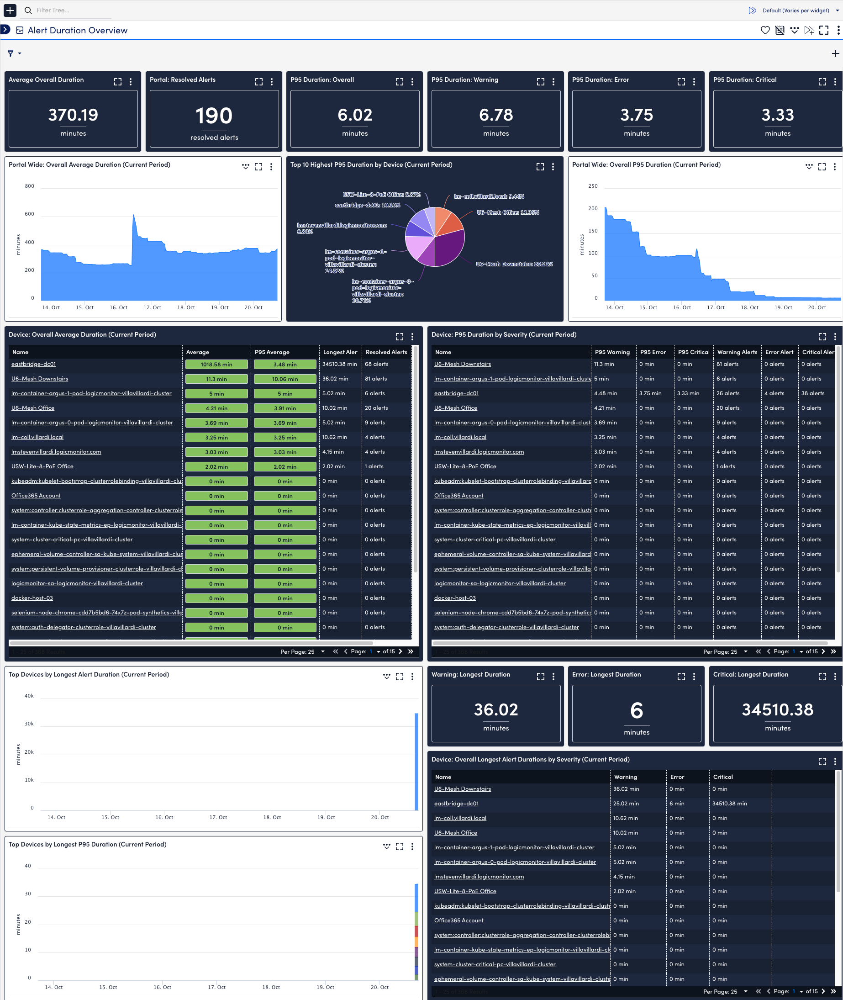
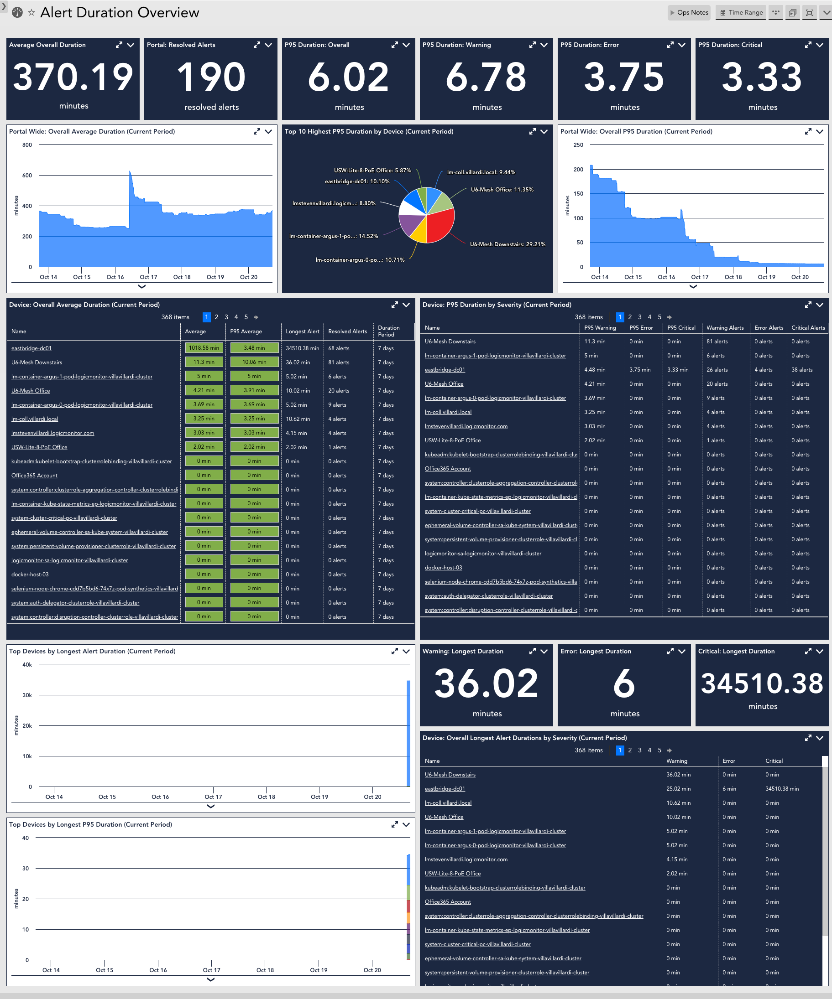

**Summary:**
The goal with this alert analysis dashboard is to provide a working example of how customers can track and measure reaction to alerts within their portal. Most customers do not currently track MTTA/R but always look to ways to reduce it, with this dashboard the idea is to be able to track and measure how alerts and their duration is trending within a customer's environment. In POV scenarios this helps to provide tangible metrics around how implementing LogicMonitor can help to reduce alert duration and for existing customers a normalized method of measuring MTTA/R and its impact to their environment. Ideally this data would be exposed as a metric endpoint on the backend vs having to poll the LM Alerts API but as a proof of concept to showcase its value this set of LogicModules have been developed as a result. Since LogicMonitor limits the amount of alert data that can be extracted via API we are limited in how far back we can poll for alerts based on customer alert volume. Generally an duration.period of 7 days is a decent default to use but tuning may be required in large accounts.

**Datasources and Dashboard hosted on Github**: [https://github.com/stevevillardi/LogicMonitor-Dashboards/tree/main/Suites/Alert%20Duration](https://github.com/stevevillardi/LogicMonitor-Dashboards/tree/main/Suites/Alert%20Duration)

**AppliesTo**: LogicMonitor Portal Metrics Resource

**Required Modules and Dashboards**:
| **Name**                                   | **Type**   | **Description**                                                                                                                               | **URL**                                                                                                                                             | LMExchange LocatorID |
|--------------------------------------------|------------|-----------------------------------------------------------------------------------------------------------------------------------------------|-----------------------------------------------------------------------------------------------------------------------------------------------------|----------------------|
| LogicMonitor_Device_Alert_Statistics       | Datasource | Tracks alert duration averages over a rolling period of time on a per device basis                                                            | https://raw.githubusercontent.com/stevevillardi/LogicMonitor-Dashboards/main/Suites/Alert%20Duration/LogicMonitor_Device_Alert_Statistics.xml       | Pending Feedback     |
| LogicMonitor_Portal_Alert_Statistics       | Datasource | Tracks alert duration averages over a rolling period of time, portal wide                                                                     | https://raw.githubusercontent.com/stevevillardi/LogicMonitor-Dashboards/main/Suites/Alert%20Duration/LogicMonitor_Portal_Alert_Statistics.xml       | Pending Feedback     |
| LogicMonitor_Portal_Alert_Statistics_Cache | Datasource | Uses script cache to collect alert and resource info for use by LogicMonitor_Device_Alert_Statistics and LogicMonitor_Portal_Alert_Statistics | https://raw.githubusercontent.com/stevevillardi/LogicMonitor-Dashboards/main/Suites/Alert%20Duration/LogicMonitor_Portal_Alert_Statistics_Cache.xml | Pending Feedback     |
| Alert Duration Overview                    | Datasource | Dashboard to showcase alert duration info collected from various LogicModules                                                                 | https://raw.githubusercontent.com/stevevillardi/LogicMonitor-Dashboards/main/Suites/Alert%20Duration/Alert_Duration_Overview.json                   | N/A                  |

**Properties**:
| **Property**                        | **Required** | **Default Value**   | **Description**                                                               |
|-------------------------------------|--------------|---------------------|-------------------------------------------------------------------------------|
| lmaccess.id                         | Yes          | N/A                 | API Access ID (Should already be set on portal metrics resource if deployed)  |
| lmaccess.key                        | Yes          | N/A                 | API Access Key (Should already be set on portal metrics resource if deployed) |
| lmaccount                           | No           | AGENT_COMPANY value | LM portal subdomain                                                           |
| alert.duration.period               | No           | 7                   | Number of days to use for duration calculation                                |
| alert.duration.excludeUnACKedAlerts | No           | false               | Exclude un-acknowledged alerts from alert duration calculation                |
| alert.duration.excludeSDTedAlerts   | No           | false               | Exclude SDTed alerts from alert duration calculation                          |

**Future**  **Improvements:**
Currently this is the first iteration of the alert duration package and their has been many ideas floating around on different tuning and filter options we could provide. Below is a list of some future enhancements we can look to add:

*   Store all cleared alerts in collector cache and only poll for newly resolved alerts. This would address the scaling challenges with large accounts but would need to see the impact this has on the collector if any. **COMPLETED**
*   Allow for more filter options on what type of alerts to include/exclude from duration calculation, such as:
    *   Alerts resolved during SDT **COMPLETED**
    *   Alerts resolved  but not routed to an escalation chain/ticket system
    *   Alerts that have log anomalies associated with them
    *   Alerts that have beeb acknowledged **COMPLETED**
    *   Certain Datasources
    *   Certain Severities
    *   Certain Devices
*   Have a dynamic way to dashboard groups of devices to showcase alert duration at an application/location specific level. This would be a great enhancement to focus on once property filter comes to dashboards and probably a more realistic way of looking at alert duration within an environment.
*   Work with dev to have a less taxing method of obtaining this information, either as an additional api endpoint similar to the portal metrics stuff or via another means.

**Deployed Dashboard Screenshot UIv4:**

**Deployed Dashboard Screenshot UIv3:**
